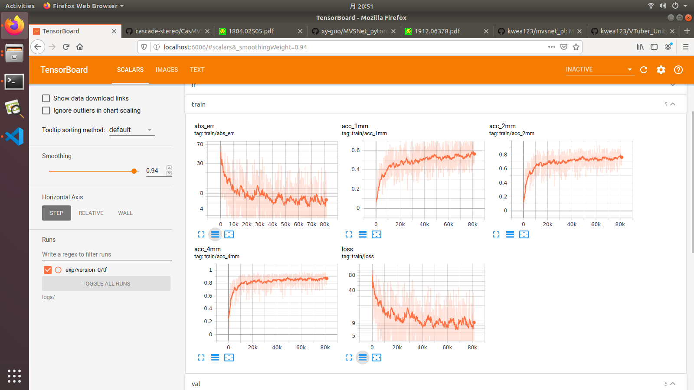
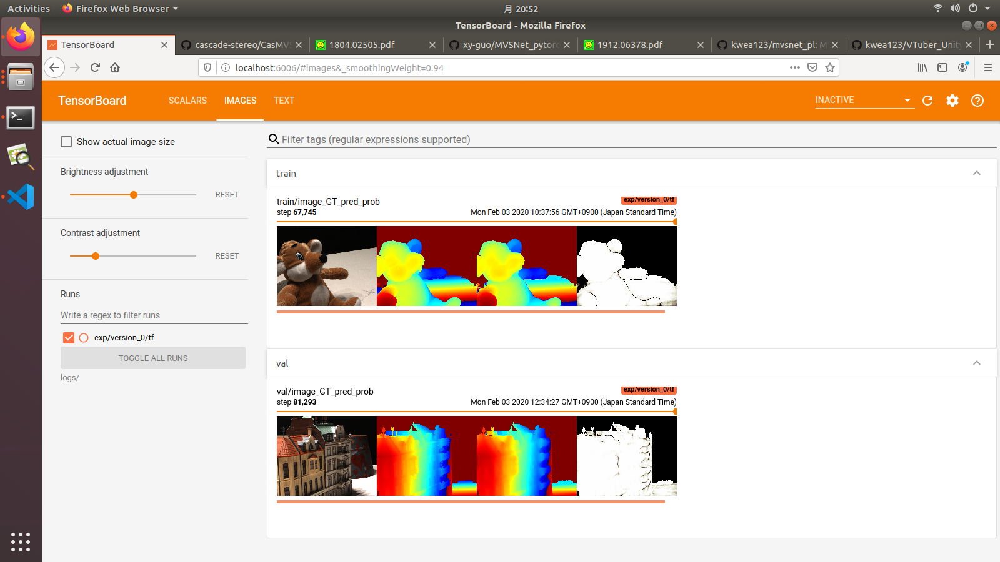

# MVSNet_pl
Unofficial implementation of [MVSNet: Depth Inference for Unstructured Multi-view Stereo](https://arxiv.org/pdf/1804.02505.pdf) using [pytorch-lightning](https://github.com/PyTorchLightning/pytorch-lightning)

# References & Credits
Official implementation: [MVSNet](https://github.com/YoYo000/MVSNet)

A pytorch implementation: [MVSNet_pytorch](https://github.com/xy-guo/MVSNet_pytorch).
This code is heavily borrowed from his implementation. Thank [xy-guo](https://github.com/xy-guo) for the effortful contribution!
Two main difference w.r.t. his repo:
1. `homo_warping` function is rewritten in a more concise and slightly faster way.
2. Use [Inplace-ABN](https://github.com/mapillary/inplace_abn) in the model to reduce GPU memory consumption (about 10%).

# Installation

## Hardware

* OS: Ubuntu 16.04 or 18.04
* NVIDIA GPU with **CUDA>=10.0** (tested with 1 RTX 2080Ti)

## Software

* Python>=3.6 (installation via [anaconda](https://www.anaconda.com/distribution/) is recommended)
* Python libraries
    * Install core requirements by `pip install -r requirements.txt`
    * Install [Inplace-ABN](https://github.com/mapillary/inplace_abn) by `pip install git+https://github.com/mapillary/inplace_abn.git@v1.0.11`

# Data download

Download the preprocessed [DTU training data](https://drive.google.com/file/d/1eDjh-_bxKKnEuz5h-HXS7EDJn59clx6V/view) from original [MVSNet repo](https://github.com/YoYo000/MVSNet) and unzip. For the description of how the data is created, please refer to the original paper.

# Training
Run
```
python train.py \
  --root_dir $DTU_DIR \
  --num_epochs 6 --batch_size 1 \
  --n_depths 192 --interval_scale 1.06 \
  --optimizer adam --lr 1e-3 --lr_scheduler cosine
```
Note that the model consumes huge GPU memory, so the batch size is generally small. For reference, the above command requires 5901MB of GPU memory.

## Example training log




# Testing
The repo is only for training purpose for now. Please refer to the other repositories mentioned at the beginning if you want to evaluate the model.
